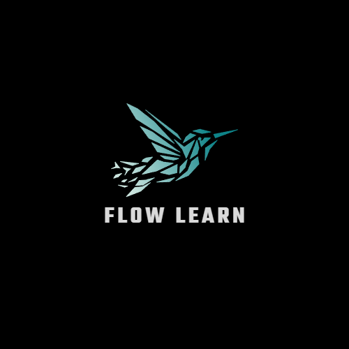
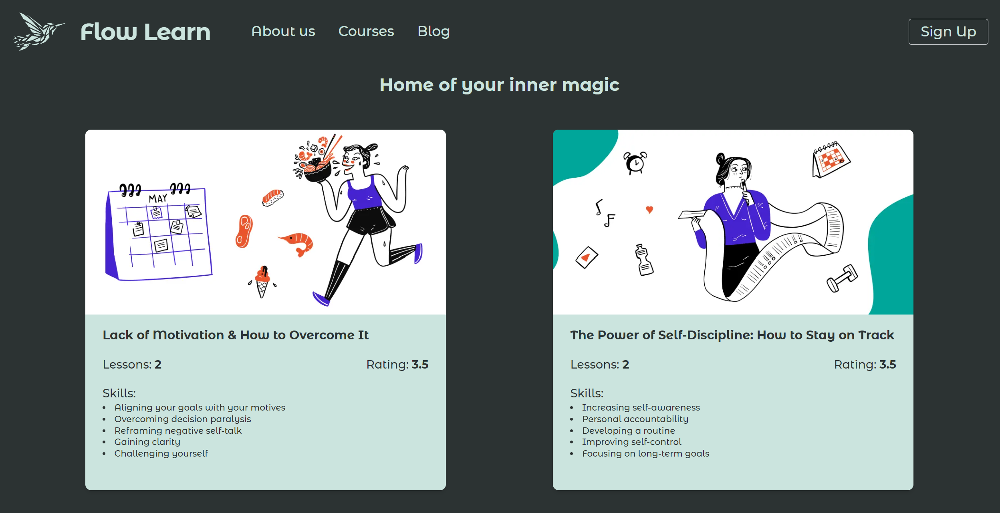
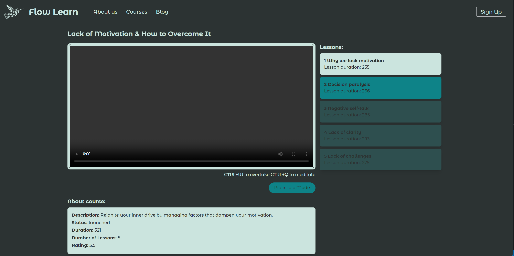
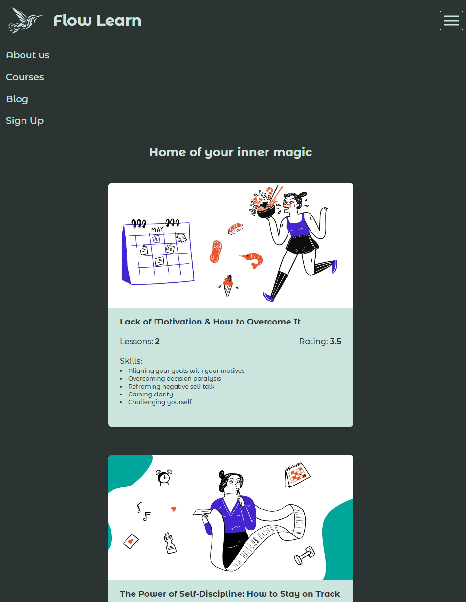
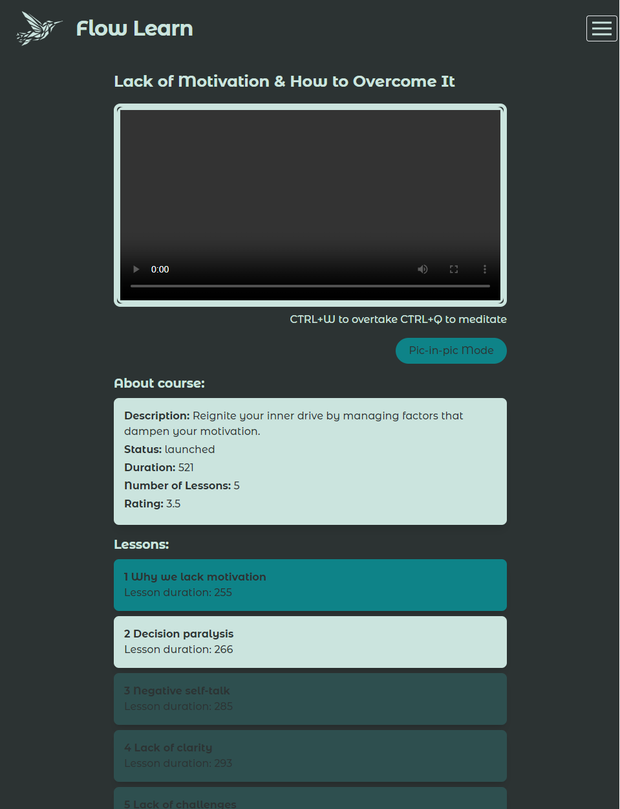
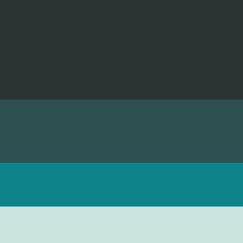

<!-- markdownlint-disable -->
# FLOW LEARN (Educational Platform)

## Table of content
&nbsp;&nbsp;&nbsp; [About Project](#about-project)\
&nbsp;&nbsp;&nbsp; [Screenshots](#screenshots)\
&nbsp;&nbsp;&nbsp; [Technologies Used](#technologies-used)\
&nbsp;&nbsp;&nbsp; [Prerequisites](#prerequisites)\
&nbsp;&nbsp;&nbsp; [Installation](#installation)\
&nbsp;&nbsp;&nbsp; [Usage](#usage)\
&nbsp;&nbsp;&nbsp; [Acknowledgments](#acknowledgments)

## About Project

This is a React-based educational platform that displays courses dynamically created from an API.
The platform contains two pages:

1.  **Page with courses** - displays all available courses
    -   10 leatest courses on a page and pagination in the end for browsing other courses
    -   when hover on a course card - preview video starts playing

2.  **Page with a specific course** - displays details about the course (videoplayer with the first video opened, list of lessons, description etc.) 
    - when user click another lesson - corresponding video is shown 
    - active lesson has specific style
    - user can't watch the locked lessons (these lessons have different style)
    - progress of the user is saved in the local storage
    - user can manipulate video speer (*CTRL+Q* to speed up and *CTRL+W* to speed down)
    - picture in picture feature for video player available through the button **Pic-in-pic Mode**

**Web application fully responsive and adapted for a mobile version.**

**Errors from APIs are processed.**

**Added animation of video downloading**

## Screenshots:

### Page with Courses

### Page with a specific course

### Mobile version

### Color Palette 

## Technologies Used:

-   React.js
-   Tailwind.css
-   SCSS (custom styles)
-   Axious library (work with API)
-   React-Router (routing through the project)

## Prerequisites

You will need to have Node.js and npm installed on your machine.

## Installation

To get started with this project, follow the steps below:
1. Clone the repository to your local machine:\
&nbsp;&nbsp;&nbsp;&nbsp;&nbsp;&nbsp; `git clone https://github.com/yshvchnk/React.js-Tailwind-FlowLearnEducationalPlatform.git`

2. Navigate to the project directory:\
&nbsp;&nbsp;&nbsp;&nbsp;&nbsp;&nbsp; `cd flowlearn`

3. Install dependencies:\
&nbsp;&nbsp;&nbsp;&nbsp;&nbsp;&nbsp; `npm install`

4. Start the development server:\
&nbsp;&nbsp;&nbsp;&nbsp;&nbsp;&nbsp; `npm start`

## Usage

Once you have started the development server, open a web browser and navigate to localhost to view the application:\
[http://localhost:3000](http://localhost:3000)

The page will reload when you make changes.\
You may also see any lint errors in the console.

## Acknowledgments
This project was made possible by the API provided by [Genesis](https://www.gen.tech/).\
This project was bootstrapped with [Create React App](https://github.com/facebook/create-react-app).